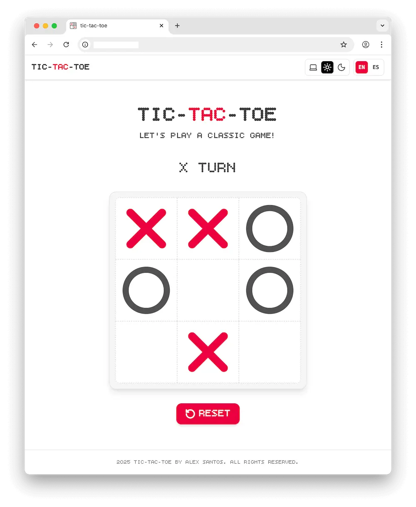
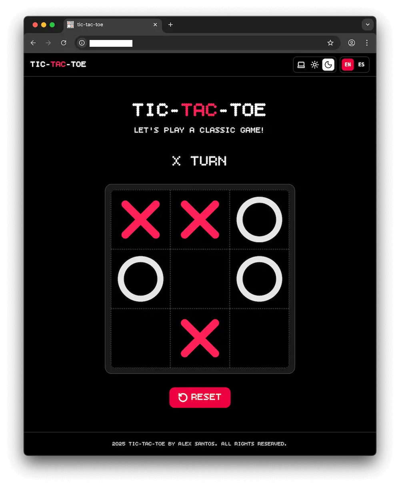

[](https://github.com/alexsantosquispe/tic-tac-toe/actions/workflows/ci_cd.yml)
[](LICENSE)

<div align="center">
  <h1>🎮 Tic-Tac-Toe</h1>
  <p align="center">
    A modern, accessible, and fully-featured implementation of the classic Tic-Tac-Toe game built with React, TypeScript, and Tailwind CSS.
  </p>

[](https://vitejs.dev/)
[](https://react.dev/)
[](https://www.typescriptlang.org/)
[](https://tailwindcss.com/)
[](https://jestjs.io/)
[](https://testing-library.com/)

</div>

---

## 📘 Table of Contents

- [Overview](#overview)
- [Screenshots](#screenshots)
- [Game Rules](#game-rules)
- [Features](#features)
- [Tech Stack](#tech-stack)
- [Getting Started](#getting-started)
- [Scripts Reference](#scripts-reference)
- [Tailwind Configuration](#tailwind-configuration)
- [Project Structure](#project-structure)
- [Roadmap](#roadmap)
- [Contributing](#contributing)
- [License](#license)
- [Acknowledgments](#acknowledgments)

---

## Overview

Play a fully functional **3×3 Tic-Tac-Toe** game with a modern, responsive, and accessible UI. This project showcases best practices in React development with TypeScript, comprehensive testing, internationalization, theme switching, and smooth animations.

### Key Highlights

- 🎯 **Fully Accessible**: WCAG compliant with screen reader support
- 🌍 **Internationalization**: Multi-language support (English/Spanish)
- 🎨 **Theme Support**: Light, dark, and system theme modes
- ✨ **Smooth Animations**: Powered by Framer Motion
- 🧪 **Comprehensive Testing**: 100% test coverage with Jest and Testing Library
- 📱 **Responsive Design**: Works perfectly on all device sizes
- ⚡ **Performance Optimized**: Code splitting and lazy loading

---

## Screenshots

<div align="center">
  
  
</div>

## Features

### Core Gameplay

- **Turn-based play**: X starts, then O; only empty squares can be selected
- **Win detection**: Rows, columns, and diagonals. Winning squares are highlighted
- **Draw detection**: Disables the board and shows "Draw!" when no moves remain
- **Reset functionality**: Start a new game at any time with smooth animations
- **Settings button**: The settings icon button shows a modal, where the player can select a playing mode and levels of difficulty

### User Experience

- **🌍 Internationalization**: Support for English and Spanish with easy language switching
- **🎨 Theme Support**: Light, dark, and system theme modes with persistent preferences
- **✨ Smooth Animations**: Framer Motion powered transitions and micro-interactions
- **📱 Responsive Design**: Optimized for desktop, tablet, and mobile devices
- **♿ Accessibility**: Full WCAG compliance with screen reader support and keyboard navigation

### Technical Features

- **⚡ Performance**: Code splitting, lazy loading, and optimized bundle size
- **🧪 Testing**: Comprehensive test suite with 100% coverage
- **🔧 Developer Experience**: ESLint, Prettier, Husky, and lint-staged for code quality
- **📦 Modern Stack**: React 19, TypeScript, Tailwind CSS v4, and Vite

## Tech Stack

### Core Technologies

- **[React 19](https://react.dev/)** - Latest React with concurrent features
- **[TypeScript](https://www.typescriptlang.org/)** - Type-safe JavaScript
- **[Vite](https://vitejs.dev/)** - Fast build tool and dev server
- **[Tailwind CSS v4](https://tailwindcss.com/)** - Utility-first CSS framework

### UI & Animation

- **[Framer Motion](https://www.framer.com/motion/)** - Smooth animations and transitions
- **[clsx](https://github.com/lukeed/clsx)** - Conditional className utility
- **[tailwind-merge](https://github.com/dcastil/tailwind-merge)** - Tailwind class merging

### Internationalization

- **[i18next](https://www.i18next.com/)** - Internationalization framework
- **[react-i18next](https://react.i18next.com/)** - React integration for i18next
- **[i18next-browser-languagedetector](https://github.com/i18next/i18next-browser-languagedetector)** - Language detection

### Testing & Quality

- **[Jest](https://jestjs.io/)** - Testing framework
- **[Testing Library](https://testing-library.com/)** - React testing utilities
- **[ESLint](https://eslint.org/)** - Code linting
- **[Prettier](https://prettier.io/)** - Code formatting
- **[Husky](https://typicode.github.io/husky/)** - Git hooks
- **[lint-staged](https://github.com/okonet/lint-staged)** - Pre-commit hooks

## Getting Started

### Prerequisites

- **Node.js 18+** (LTS recommended)
- **pnpm 8+** (preferred package manager)
- Modern web browser with ES2020+ support

### Installation

Using pnpm (recommended):

```bash
pnpm install
```

Using npm:

```bash
npm install
```

### Run in Development

```bash
pnpm dev
```

Then open the URL shown in your terminal (typically http://localhost:5173).

### Build for Production

```bash
pnpm build
```

The output will be in `dist/`.

### Preview Production Build

```bash
pnpm preview
```

### Testing

Run the test suite:

```bash
pnpm test
```

Run tests with coverage:

```bash
pnpm test:coverage
```

Update test snapshots:

```bash
pnpm test:update
```

### Code Quality

Lint the codebase:

```bash
pnpm lint
```

Fix linting issues automatically:

```bash
pnpm lint:fix
```

Check code formatting:

```bash
pnpm format:check
```

Format code automatically:

```bash
pnpm format:fix
```

## Game Rules

1. **Players**: X goes first, then O. Players alternate turns.
2. **Making a move**: Click an empty square to place your mark.
3. **Winning**: First to align three marks in a row, column, or diagonal wins. The winning line is highlighted.
4. **Draw**: If all 9 squares are filled without a winner, the game ends in a draw.
5. **End of game**: After a win or a draw, the board is disabled until you click Reset.

## Tailwind CSS Setup Notes

This project uses Tailwind CSS v4 with the official Vite plugin.

- Dependencies:
  - `tailwindcss`
  - `@tailwindcss/vite`
- The Vite plugin is declared in `package.json` and integrated through the build system. Global styles and Tailwind layers should be configured in `src/index.css`.

## Available Scripts

The following scripts are available in `package.json`:

### Development

- `dev` — Start the Vite development server with hot reload
- `build` — Type-check and build for production
- `preview` — Preview the production build locally

### Testing

- `test` — Run the Jest test suite
- `test:coverage` — Run tests with coverage report
- `test:update` — Update Jest snapshots

### Code Quality

- `lint` — Run ESLint on the project
- `lint:fix` — Fix ESLint issues automatically
- `format:check` — Check code formatting with Prettier
- `format:fix` — Format code with Prettier

### Git Hooks

- `prepare` — Set up Husky git hooks (runs automatically after install)

## Project Structure

```
src/
├── components/
│   ├── atoms/          # Basic UI components (Button, Footer, etc.)
│   └── molecules/      # Composite components (Board, Square)
├── context/            # React Context providers (Game, Theme)
├── hooks/              # Custom React hooks
├── i18n/               # Internationalization configuration
│   └── locales/        # Translation files (en, es)
├── icons/              # SVG icon components
├── tests/              # Test utilities and helpers
├── utils/              # Utility functions
├── App.tsx             # Main application component
└── main.tsx            # Application entry point
```

## 🗺️ Roadmap

- [ ] CPU Difficulty Levels (Easy / Medium / Hard)
- [ ] Configurable Game Modes (2 Players / vs CPU)
- [ ] UI Animations for Turn Transitions
- [ ] Persistent Scores & Ranking
- [ ] CPU “Thinking” Indicator

---

## Contributing

Contributions are welcome!

### 🐛 Bug Reports

- Use the issue template to provide detailed information
- Include steps to reproduce the issue
- Specify your environment (OS, browser, Node.js version)

### ✨ Feature Requests

- Describe the feature and its use case
- Consider the project's scope and accessibility requirements
- Check existing issues to avoid duplicates

### 🔧 Development Setup

1. Fork the repository
2. Create a feature branch: `git checkout -b feature/amazing-feature`
3. Install dependencies: `pnpm install`
4. Make your changes
5. Run tests: `pnpm test`
6. Check code quality: `pnpm lint && pnpm format:check`
7. Commit your changes: `git commit -m 'Add amazing feature'`
8. Push to the branch: `git push origin feature/amazing-feature`
9. Open a Pull Request

### 📋 Development Guidelines

- Follow the existing code style and patterns
- Write tests for new features
- Ensure accessibility compliance
- Update documentation as needed
- Keep commits atomic and well-described

### 🧪 Testing Requirements

- Maintain 100% test coverage
- Write meaningful test descriptions
- Test both happy path and edge cases
- Include accessibility tests where applicable

## License

This project is licensed under the MIT License - see the [LICENSE](LICENSE) file for details.

### Attribution

If you use this project in your work, please include proper attribution:

- **For code usage**: Include a link to this repository: `https://github.com/alexsantosquispe/tic-tac-toe`
- **For inspiration**: Credit Alex Santos as the original author
- **For forks/derivatives**: Maintain the original copyright notice and add your own

This helps support the project and gives proper credit to the original work! 🙏

## Acknowledgments

- Built with ❤️ using modern React patterns
- Inspired by classic Tic-Tac-Toe gameplay
- Designed with accessibility and user experience in mind
- Special thanks to the open-source community for the amazing tools and libraries

---

<div align="center">
  <p>Made with ❤️ by <a href="https://github.com/alexsantosquispe">Alex Santos</a></p>
  <p>⭐ Star this repo if you found it helpful!</p>
</div>
