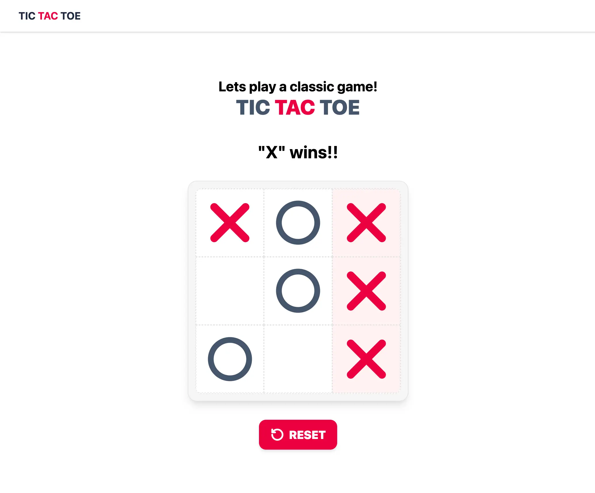

<div align="center">
  <h1>Tic-Tac-Toe</h1>
  <p align="center">
    A clean, modern implementation of the classic Tic-Tac-Toe game built with React.
  </p>

[](https://vitejs.dev/)
[](https://react.dev/)
[](https://www.typescriptlang.org/)
[](https://tailwindcss.com/)

</div>

---

## Overview

Play a fully functional **3×3 Tic-Tac-Toe** with a responsive, accessible UI.  
Features include alternating turns, winner detection (with highlight), draw detection, reset option, and live status updates for screen readers.

---

## Screenshots

<div align="center">
  
</div>

## Features

- **Turn-based play**: X starts, then O; only empty squares can be selected.
- **Win detection**: Rows, columns, diagonals; winning squares are highlighted.
- **Draw detection**: Disables the board and shows “Draw!” when no moves remain.
- **Reset**: Start a new game at any time.

## Getting Started

### Prerequisites

- Node.js 18+ (LTS recommended)
- pnpm 8+ (preferred). You can also use npm or yarn.

### Installation

Using pnpm (recommended):

```bash
pnpm install
```

Using npm:

```bash
npm install
```

### Run in Development

```bash
pnpm dev
```

Then open the URL shown in your terminal (typically http://localhost:5173).

### Build for Production

```bash
pnpm build
```

The output will be in `dist/`.

### Preview Production Build

```bash
pnpm preview
```

### Lint

```bash
pnpm lint
```

## Game Rules

1. **Players**: X goes first, then O. Players alternate turns.
2. **Making a move**: Click an empty square to place your mark.
3. **Winning**: First to align three marks in a row, column, or diagonal wins. The winning line is highlighted.
4. **Draw**: If all 9 squares are filled without a winner, the game ends in a draw.
5. **End of game**: After a win or a draw, the board is disabled until you click Reset.

## Tailwind CSS Setup Notes

This project uses Tailwind CSS v4 with the official Vite plugin.

- Dependencies:
  - `tailwindcss`
  - `@tailwindcss/vite`
- The Vite plugin is declared in `package.json` and integrated through the build system. Global styles and Tailwind layers should be configured in `src/index.css`.

## Available Scripts

The following scripts are defined in `package.json`:

- `dev` — Start the Vite dev server
- `build` — Type-check (`tsc -b`) and build for production
- `preview` — Preview the production build locally
- `lint` — Run ESLint on the project

## Contributing

Contributions are welcome! Feel free to open issues or submit PRs to improve features, fix bugs, or enhance documentation.
